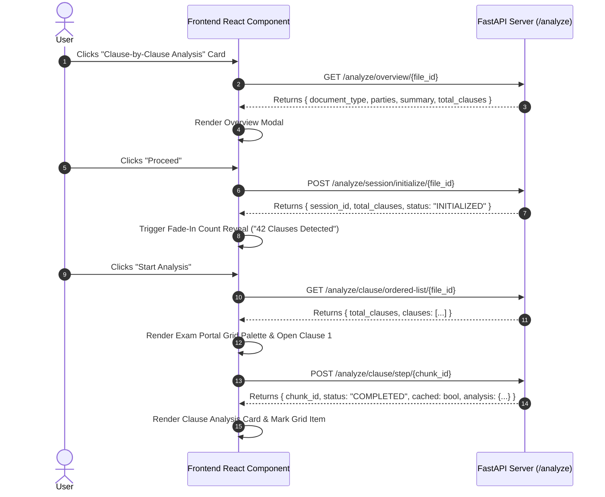

# 🚀 ANTIGRAVITY FRONTEND SPECIFICATION
## Feature: Exam-Portal Style Clause-by-Clause Analysis

> **INSTRUCTION FOR AI AGENT (ANTIGRAVITY / COPILOT):**
> You are tasked with implementing the frontend UI for the **Clause-by-Clause Analysis** feature.
> Follow the exact step-by-step user journey, UI component layout, state machine, and API call sequence detailed below.

---

## 📑 1. Architectural Overview & User Journey

The Clause-by-Clause analysis feature operates like an **Online Examination Portal**. Instead of overwhelming the user with a 40-page contract, the user progresses through clauses sequentially (`Clause 1 of 42`, `Clause 2 of 42`, etc.), supported by a **Clause Navigation Palette Grid**.

```
[Page 1: Feature Hub] ──► Select "Clause-by-Clause Analysis"
                                  │
                                  ▼
                    [Step 1: Document Overview Modal]
                    (Displays: Document Type, Parties, Jurisdiction, Plain Summary)
                                  │
                                  ▼ Click "Proceed"
                    [Step 2: Fade-In Count Reveal]
                    (Displays: "42 Clauses Detected in this Contract")
                                  │
                                  ▼ Click "Start Analysis"
                    [Step 3: Exam-Portal Workspace]
                    (Serial Navigation: [1🟢] [2🟢] [3🟡] [4⚪] ... [42⚪])
```

---

## 🔌 2. API Endpoint Specification & Sequence

Base URL: `http://localhost:8000/analyze` (or your FastAPI server URL)

### 📊 API Call Sequence Diagram



---

### API Reference Table

| Step | Method | Endpoint | Payload / Params | Expected Response Key Fields |
| :--- | :--- | :--- | :--- | :--- |
| **1. Overview** | `GET` | `/analyze/overview/{file_id}` | Path: `file_id` | `document_type`, `parties`, `jurisdiction`, `summary`, `total_clauses` |
| **2. Init Session** | `POST` | `/analyze/session/initialize/{file_id}` | Path: `file_id` | `session_id`, `total_clauses`, `status` |
| **3. Exam Grid** | `GET` | `/analyze/clause/ordered-list/{file_id}` | Path: `file_id` | `total_clauses`, `completed`, `clauses: [{ chunk_no, chunk_id, status, risk_level, aliases }]` |
| **4. Clause Step** | `POST` | `/analyze/clause/step/{chunk_id}` | Path: `chunk_id`<br>Query: `force_refresh=false` | `chunk_id`, `status`, `cached`, `analysis: { explanation, risk_level, risk_analysis, negotiation_advice, key_risks, revised_clause_text }` |

---

## 🎨 3. UI Component Layout & Wireframe

### Component 1: Feature Hub Page (`/hub`)
Display 3 distinct modern cards:
1. **Card 1: Clause-by-Clause Analysis** *(Active)*
   * Description: *"Navigate contract clauses step-by-step with instant AI legal risk analysis, plain-English explanations, and counter-offer recommendations."*
   * CTA Button: `"Start Clause Review →"`
2. **Card 2: Flash Analysis** *(Coming Soon / Secondary)*
3. **Card 3: Legal AI Chatbot** *(Secondary)*

---

### Component 2: Document Overview Modal
When Card 1 is clicked, open a modal powered by `GET /analyze/overview/{file_id}`:
* Header: Document Identity (e.g., `"Commercial Lease Agreement"`)
* Metadata Badges:
  * 🏢 **Parties**: `Landlord Inc.` & `Startup LLC`
  * ⚖️ **Jurisdiction**: `State of California`
* Section: **Plain English Summary**
* Action: Primary Button `"Proceed to Clause Count →"`

---

### Component 3: Fade-In Clause Count Reveal Card
Upon clicking "Proceed", show an animated fade-in card:
* Large Typography Counter: `42 Clauses Detected`
* Subtext: *"Organized in serial order for guided step-by-step examination."*
* Primary Button: `"Start Clause Analysis 🚀"` (Calls `/analyze/clause/ordered-list/{file_id}` and launches workspace).

---

### Component 4: Exam-Portal Workspace (Main Interface)

```
┌────────────────────────────────────────────────────────────────────────────────────────┐
│ 📄 Document: Commercial Lease Agreement  │ Progress: [████████░░░░] 8/42 (19%)        │
├──────────────────────────────────────────┴─────────────────────────────────────────────┤
│                                                                                        │
│ 🎯 EXAM PORTAL WINDOW (Clause Navigation Palette)                                      │
│ ┌────┬────┬────┬────┬────┬────┬────┬────┬────┬────┬────┬────┬────┬────┬────┐          │
│ │ 1🟢│ 2🟢│ 3🟡│ 4⚪│ 5⚪│ 6⚪│ 7⚪│ 8⚪│ 9⚪│10⚪│11⚪│12⚪│13⚪│14⚪│15⚪│ ...│          │
│ └────┴────┴────┴────┴────┴────┴────┴────┴────┴────┴────┴────┴────┴────┴────┘          │
│ Legend: 🟢 Completed  |  🟡 Currently Analyzing  |  ⚪ Pending                         │
├────────────────────────────────────────────────────────────────────────────────────────┤
│                                                                                        │
│ 📌 CURRENT CLAUSE: Clause 3 of 42 (Section 4.2 - Indemnification)                      │
│                                                                                        │
│ 📜 ORIGINAL LEGALSE TEXT (Chunk Content):                                              │
│ "Tenant agrees to indemnify, defend, and hold harmless Landlord from and against any  │
│  and all claims, damages, liabilities, costs, and expenses..."                         │
│                                                                                        │
├────────────────────────────────────────────────────────────────────────────────────────┤
│                                                                                        │
│ 🤖 AI LEGAL RISK ANALYSIS:                                                             │
│                                                                                        │
│ 🏷️ Risk Level: [ 🔴 HIGH RISK (Score 8/10) ]                                           │
│                                                                                        │
│ 💡 Plain English Explanation:                                                          │
│ "This clause forces you to pay for all legal costs and damages if any dispute arises,  │
│  even if the landlord was partially at fault."                                         │
│                                                                                        │
│ ⚠️ Key Risks Identified:                                                               │
│ • Unlimited financial liability without any monetary cap.                              │
│ • Obligation to defend the landlord against third-party claims.                        │
│                                                                                        │
│ 🛡️ Recommended Redline Counter-Offer:                                                  │
│ "Tenant's liability under this section shall be capped at $50,000 and shall exclude    │
│  consequential damages."  [📋 Copy Redline Text]                                       │
│                                                                                        │
│ 💬 Negotiation Strategy & Talking Points:                                              │
│ • Request a mutual indemnification clause.                                             │
│ • Insert a total liability ceiling equal to 12 months of rent.                         │
│                                                                                        │
├────────────────────────────────────────────────────────────────────────────────────────┤
│                                                                                        │
│  [◀ Previous Clause]                                             [Next Clause ▶]       │
└────────────────────────────────────────────────────────────────────────────────────────┘
```

---

## 🔄 4. State Management Guidelines for Frontend

1. **Active Clause Index (`activeChunkIndex`)**: Zero-based index tracking the currently selected clause (`0` to `total_clauses - 1`).
2. **Grid Status Array (`clausesList`)**: Array of `{ chunk_id, chunk_no, status, risk_level }`.
   * `status == 'COMPLETED'`: Render button with 🟢 green badge / background.
   * `status == 'IN_PROGRESS'`: Render button with 🟡 yellow pulse animation.
   * `status == 'PENDING'`: Render button with ⚪ gray outline.
3. **Cache-First Step Execution**:
   * When user clicks `[Next Clause ▶]` or clicks grid button `[7]`:
   * Call `POST /analyze/clause/step/{target_chunk_id}`.
   * If the clause was already analyzed, the backend returns `"cached": true` in `<50ms`. Show the analysis instantly without a loading spinner!
   * If `"cached": false`, show a sleek skeleton loader while the AI agent runs.

---

## 💻 5. Ready-to-Use React Fetch Snippets

```typescript
// 1. Fetch Ordered Clauses for Exam Grid
async function fetchExamGrid(fileId: string) {
  const res = await fetch(`http://localhost:8000/analyze/clause/ordered-list/${fileId}`);
  const data = await res.json();
  // data = { total_clauses: 42, completed: 8, clauses: [...] }
  return data;
}

// 2. Execute Step Analysis for Current Clause
async function executeClauseStep(chunkId: str) {
  const res = await fetch(`http://localhost:8000/analyze/clause/step/${chunkId}`, {
    method: 'POST',
    headers: { 'Content-Type': 'application/json' }
  });
  const data = await res.json();
  // data = { chunk_id: "...", status: "COMPLETED", cached: true/false, analysis: {...} }
  return data;
}
```
